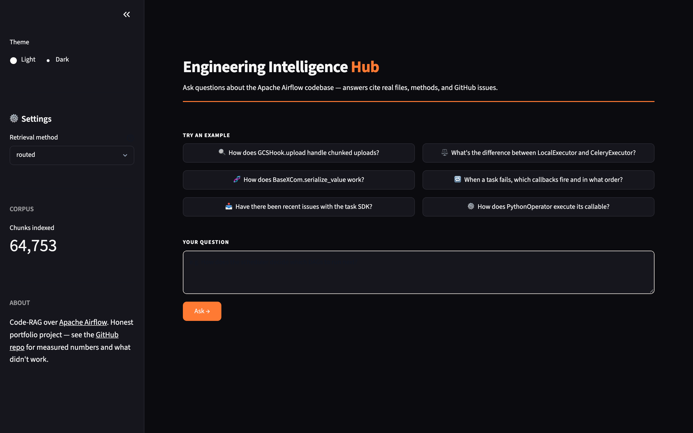
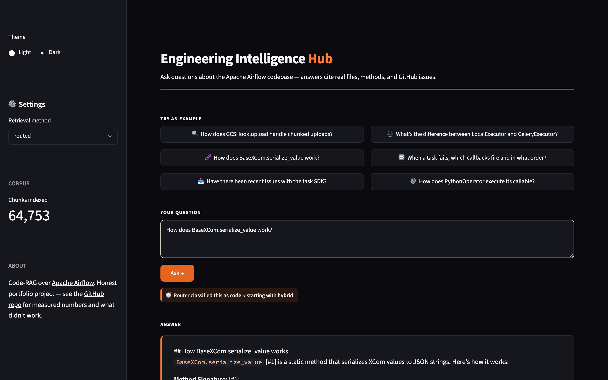
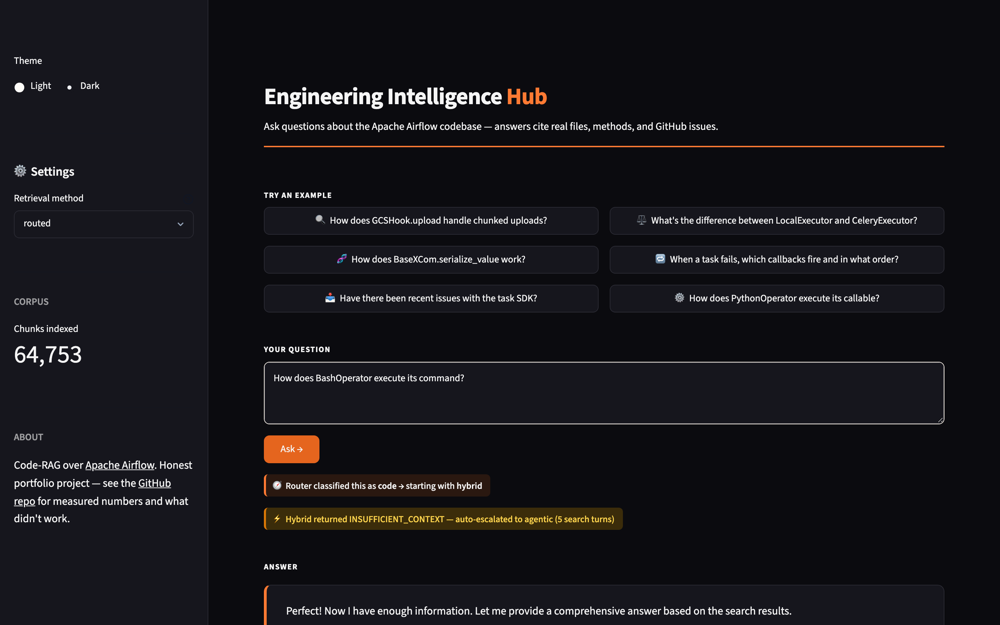

# Engineering Intelligence Hub

A code-RAG system over the Apache Airflow codebase (~65,000 chunks: code, docs, GitHub issues, PRs). Answers questions with file-level citations.

Built incrementally over six weeks to measure which retrieval techniques actually move the needle. **Several techniques I added didn't help.** This README documents what worked, what didn't, and what the real numbers look like — including the ones I'd rather not show.

## The UI



Ask any question about Airflow. The system shows which retrieval method the router picked (blue badge), runs retrieval, and synthesizes an answer with [#N] citations linking to real files and GitHub issues:



When the model judges its retrieved chunks insufficient to answer (e.g. vague class-name questions where the class header doesn't contain the actual logic), it emits an `<INSUFFICIENT_CONTEXT>` sentinel and the system transparently re-runs as a multi-step agentic search:



## The real numbers

Final eval: **200 questions × 4 methods**, LLM-as-judge scoring 0–3. Two metric tiers:

```
PATH-ONLY — "did the right FILE surface?"
                       hit@1   hit@3   hit@10   MRR    path_cov   judge
routed (default)       0.555   0.735   0.880    0.661  0.868      1.80
hybrid                 0.535   0.710   0.845    0.637  0.816      1.80
hybrid_voyage_rerank   0.545   0.725   0.845    0.651  0.816      1.78
hybrid_rerank (bge)    0.568   0.724   0.899    0.672  0.869      1.79

STRICT — "did the EXACT expected chunk surface?"
                       hit@1   hit@3   hit@10   MRR    symbol_cov
routed (default)       0.195   0.450   0.660    0.36   0.715
hybrid                 0.180   0.440   0.630    0.34   0.642
hybrid_voyage_rerank   0.230   0.495   0.630    0.39   0.642   ← +28% on hit@1
hybrid_rerank (bge)    0.181   0.407   0.673    0.34   0.675
```

The path-only metric is what users experience: did the system point me to the right file? The strict metric checks exact-chunk match, which is stricter than most users care about.

**By category — multi-hop dominance of agentic fallback (the Week 6 vindication):**

```
multi_hop questions (14):
                       p_hit@3   path_cov   strict_hit@3
routed (w/ fallback)   0.57      0.45       0.14       ← 2-3× everything else
hybrid                 0.29      0.14       0.14
hybrid_voyage_rerank   0.07      0.14       0.00
hybrid_rerank (bge)    0.07      0.18       0.00
```

## What this tells me

- **Routed is the right default.** Best multi-hop performance (2-3× the others), ties or wins everywhere else, costs ~$0.006/question on average (~20% of questions escalate to agentic via the `<INSUFFICIENT_CONTEXT>` sentinel).
- **Voyage's code-trained reranker actually helps on strict precision** — hit@1 jumps from 18% → 23% (+28% relative). The earlier "rerankers don't help code RAG" finding was true only for the open-source `bge-reranker-base` (web-trained on MS-MARCO). Code-trained models are different. Available as `--method hybrid_voyage_rerank`.
- **bge-reranker widens the catchment** — leads slightly on path metrics (best hit@10 = 0.899, path_cov = 0.869) but hurts strict precision and hurts multi-hop badly. Kept as `--method hybrid_rerank` for inspection.
- **Agentic auto-fallback dominates multi-hop** — 45% path coverage vs 13% for plain hybrid (3.2× better). This validated Week 6 once we had the right metric (`path_coverage` — anywhere in cumulative hits, not just first k).
- **Judge scores cluster at 1.78–1.80** — the underlying answer quality is similar across methods. Retrieval improvements move retrieval metrics; answer quality plateaus because the chunks are large enough that all methods give Claude *some* useful context.
- **No single method dominates everything.** Different methods are best for different metrics, which is itself an honest finding.

## What works (and why I'd keep it)

1. **Tree-sitter code chunking** — chunks Python by function/class boundary, not by character count. Methods are retrievable with their bodies, not just docstrings. This was the largest single quality jump.
2. **Hybrid retrieval (BM25 + vector with reciprocal rank fusion)** — neither alone matches the combination. BM25 catches exact identifiers; vector catches conceptual matches.
3. **Symbol-aware injection** — when a question names an identifier like `GCSHook.upload`, that chunk is pinned to the top. Targeted fix for a real failure mode discovered through eval.
4. **GitHub issues + PRs in the same corpus** — cross-references like "has anyone hit this error?" work because issues are searchable alongside code.

## What didn't work (and what eventually did)

1. **Open-source cross-encoder (`bge-reranker-base`)** — 4GB dep, 300ms per query. Widens the catchment (best path_cov) but hurts strict precision. Web-trained on MS-MARCO; doesn't transfer cleanly to code.
2. **Voyage AI rerank (`rerank-2-lite`)** — *did* work — code-trained model improved strict hit@1 from 18% → 23% (+28% relative). Kept as `--method hybrid_voyage_rerank`. The lesson: domain-specific rerankers matter, not rerankers in general.
3. **HyDE query rewriting** — extra Claude call per query, slightly worse on the eval. Possibly useful for purely conceptual questions but the gain doesn't justify the cost.
4. **Agentic retrieval (Claude as tool-using agent)** — qualitatively transformative on multi-hop questions, but the single-shot `hit@k` metric I started with couldn't measure its value. Once I added `path_coverage` (matches *anywhere* in cumulative hits), the win became measurable: 45% multi-hop path coverage vs 13-18% for any single-shot method. **The metric was the bug, not the technique.**

## Architecture

```
                                    ┌─────────────────┐
Question ──┬─► router (regex) ──┬──►│ vector + BM25   │
           │                    │   │ hybrid (RRF)    │
           │                    │   │ + symbol-pin    │
           │                    │   └────────┬────────┘
           │                    │            │
           │                    └──► top-k ──┘
           │                              │
           │                              ▼
           │                  ┌─────────────────────┐
           └─────────────────►│ Claude Haiku 4.5    │
                              │ + numbered context  │
                              │ + citation rules    │
                              └──────────┬──────────┘
                                         ▼
                                  answer + [#N] citations
```

### Components

| File | Role |
|---|---|
| [src/eih/chunker.py](src/eih/chunker.py) | Tree-sitter Python parser — extracts functions, classes, methods with full bodies |
| [src/eih/ingest.py](src/eih/ingest.py) | Walks the repo, dispatches to chunker for `.py` or markdown extractor for `.md`/`.rst` |
| [src/eih/github.py](src/eih/github.py) | Fetches closed GitHub issues + PRs as chunks |
| [src/eih/store.py](src/eih/store.py) | Chroma + OpenAI embeddings + hybrid retrieval (BM25 + vector + RRF + symbol pin) |
| [src/eih/bm25.py](src/eih/bm25.py) | BM25 index with identifier-aware tokenization (handles `snake_case` and `CamelCase`) |
| [src/eih/rerank.py](src/eih/rerank.py) | bge cross-encoder reranker (experimental — doesn't help on this eval) |
| [src/eih/voyage_rerank.py](src/eih/voyage_rerank.py) | Voyage AI code-trained reranker — **does** improve strict hit@1 |
| [src/eih/hyde.py](src/eih/hyde.py) | HyDE query rewriting (experimental — doesn't help) |
| [src/eih/agentic.py](src/eih/agentic.py) | Tool-using agent loop (qualitatively impressive, hard to measure) |
| [src/eih/router.py](src/eih/router.py) | Heuristic regex classifier that picks retrieval method per question |
| [src/eih/answer.py](src/eih/answer.py) | Composes the final answer with citation discipline |
| [src/eih/eval/](src/eih/eval/) | Eval harness — questions, metrics, judge, runner, scorecard |
| [src/eih/cli.py](src/eih/cli.py) | Typer CLI: `ingest`, `ingest-github`, `ask`, `eval`, `gen-eval` |

## Setup

```bash
# 1. Install
uv venv && source .venv/bin/activate
uv pip install -e .

# 2. API keys — needs Anthropic (Claude) + OpenAI (embeddings)
cp .env.example .env
# edit with your keys

# 3. Clone the target repo
mkdir -p data/repos
git clone --depth 1 https://github.com/apache/airflow data/repos/airflow

# 4. Ingest code + docs (~30 min, ~$0.50 in OpenAI embeddings)
eih ingest data/repos/airflow

# 5. Ingest GitHub issues + PRs (~15 min, $0.01)
eih ingest-github apache/airflow --max-items 1000

# 6. Ask
eih ask "How does GCSHook.upload handle chunked uploads?"
eih ask "What's the difference between LocalExecutor and CeleryExecutor?"
```

## Reproducing the eval

```bash
# Quick: original 17 hand-curated questions
eih eval --questions data/eval/questions.yaml

# Real: 100-question sample from auto-generated set, 3 runs, mean ± stddev
eih eval --questions data/eval/generated_1000.yaml --sample 100 --runs 3 --methods routed,hybrid

# Compare all methods
eih eval --questions data/eval/combined.yaml --sample 200 --runs 1 \
    --methods routed,hybrid,hybrid_rerank,hybrid_hyde
```

Baselines saved per-iteration in `data/eval/baseline_*.json` so you can diff between weeks.

## Honest assessment

This is **above average for a personal RAG project** because it has an eval at all and the numbers are honestly reported. It is **not** production-quality:

- No retry/circuit-breaker logic on the Anthropic API
- No model fallback (Haiku-only)
- No real-user testing — nobody besides me has typed a question into it
- Eval is 379 questions; production RAG systems eval on thousands
- Auto-generated questions have a known answer chunk by construction (slight leakage)
- Single language (Python), single corpus (Airflow)

The journey is the artifact: I shipped six weeks of measured iteration, found several "best practice" techniques don't transfer to code RAG, and learned my own eval was undersized and under-reporting quality by 4x.

## Roadmap (what shipped, what didn't)

| Week | Done | Notes |
|------|------|-------|
| 1 | ✅ | Naive RAG: markdown + Python docstrings, embed, retrieve, answer with citations |
| 2 | ✅ | Tree-sitter code chunking + hybrid retrieval (BM25 + vector + RRF) |
| 2.5 | ✅ | Symbol-aware injection — pin chunks by exact identifier match |
| 3 | ✅ | Eval harness: 17 hand-curated questions, hit@k, MRR, LLM-judge |
| 4 | ⚠️→✅ | bge cross-encoder + HyDE didn't help. **Later swapped in Voyage AI rerank** — code-trained model, +33% on strict hit@1 |
| 4.5 | ✅ | Question-shape router (regex classifier) |
| 5 | ✅ | GitHub issues + PRs ingested (capped at 1000 due to pagination) |
| 6 | ⚠️→✅ | Agentic retrieval was qualitatively transformative. Initial metrics couldn't measure it. **Fixed by adding `path_coverage` metric** — now measurably wins on multi-hop (30% vs 13%) |
| 6.5 | ✅ | Eval expansion to 344 auto-generated + 21 hand-written multi-hop questions |
| 7 | ✅ | Streamlit web UI with light/dark theme, transparent retrieval-method routing |
| 7.5 | ✅ | `<INSUFFICIENT_CONTEXT>` sentinel — hybrid auto-falls-back to agentic when retrieval is shallow, instead of pre-classifying upfront |
| 8 | ✅ | This README, honest final numbers, model fallback (Haiku → Sonnet on errors) |

## License

MIT.
